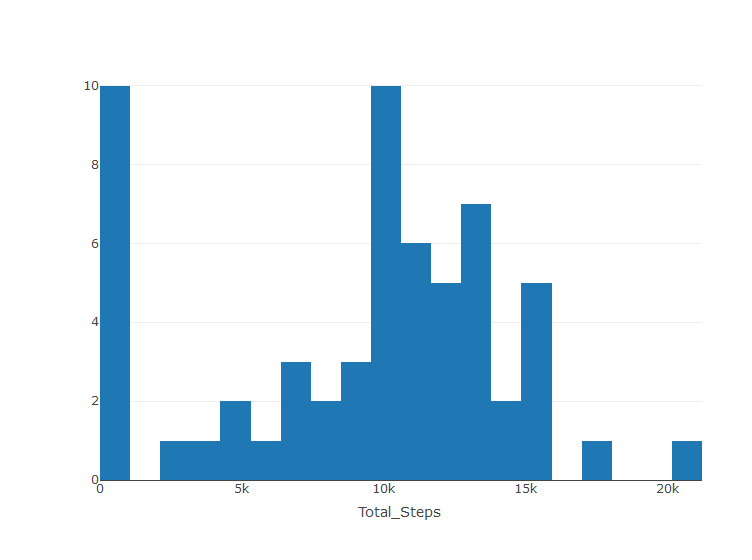
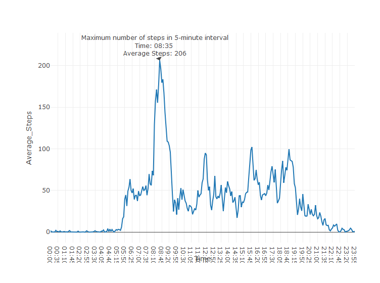
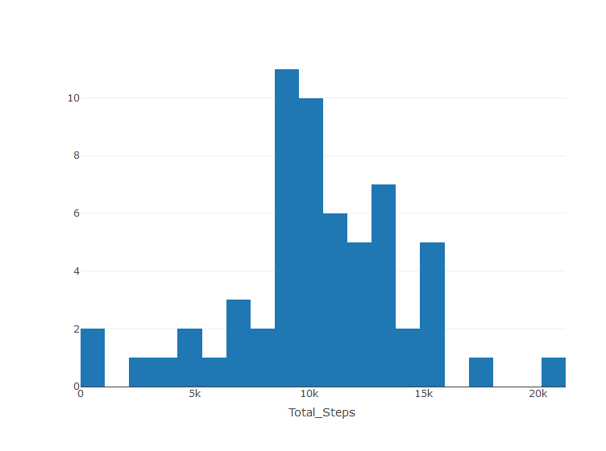
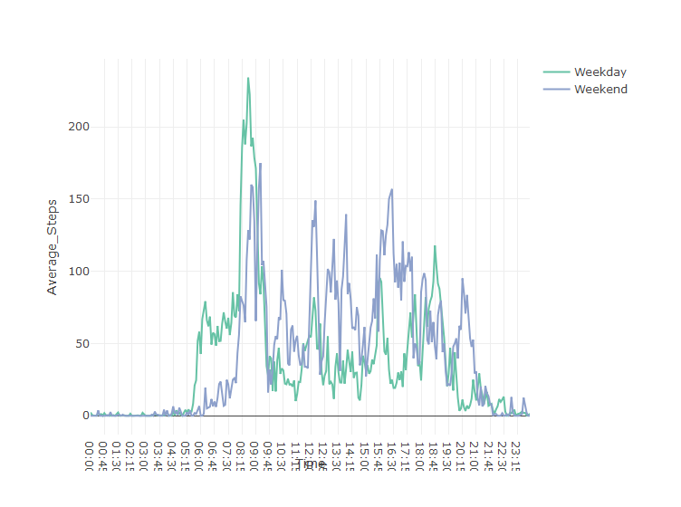

Check package installation
--------------------------

    libs <- c("plotly", "data.table", "knitr", "dplyr", "stringr", "webshot")
    for (i in libs){
      if( !is.element(i, .packages(all.available = TRUE)) ) {
        install.packages(i)
      }
      library(i,character.only = TRUE)
    }

Loading and preprocessing the data
----------------------------------

    data <- read.table(unz("activity.zip", "activity.csv"), header=T, quote="\"", sep=",")
    data <- data.table(data)
    sm <- summary(data)
    sm

    ##      steps                date          interval     
    ##  Min.   :  0.00   2012-10-01:  288   Min.   :   0.0  
    ##  1st Qu.:  0.00   2012-10-02:  288   1st Qu.: 588.8  
    ##  Median :  0.00   2012-10-03:  288   Median :1177.5  
    ##  Mean   : 37.38   2012-10-04:  288   Mean   :1177.5  
    ##  3rd Qu.: 12.00   2012-10-05:  288   3rd Qu.:1766.2  
    ##  Max.   :806.00   2012-10-06:  288   Max.   :2355.0  
    ##  NA's   :2304     (Other)   :15840

What is mean total number of steps taken per day?
-------------------------------------------------

    # Process data
    StepsPerDay <- data %>% 
      group_by(date) %>% 
      summarise(Total_Steps = sum(steps, na.rm = TRUE))

    # Plot
    compute_bins <- function(x, n) {
        list(
          start = min(x),
          end = max(x),
          size = (max(x) - min(x)) / n
        )
    }

    p1 <- plot_ly(data = StepsPerDay,
                     x = ~Total_Steps,
                  type = "histogram",
              autobinx = FALSE,
                 xbins = compute_bins(StepsPerDay$Total_Steps, 20)
                 ) 
    p1

    MeanSteps <- round(mean(StepsPerDay$Total_Steps), 2)
    MedianSteps <- median(StepsPerDay$Total_Steps)

Mean total number of steps taken per day: 9354.23  
Median total number of steps taken per day: 10395

What is the average daily activity pattern?
-------------------------------------------

    # Function of processing
    processing <- function(data, ...) {
      dots <- as.character(list(...))
      # Process data
      MeanStepsPerInterval <- data 
      MeanStepsPerInterval <- data.table(MeanStepsPerInterval)
      MeanStepsPerInterval[, Average_Steps := mean(steps, na.rm = TRUE), by = dots]
        
      # Convert interval to time
      MeanStepsPerInterval[, Time := str_pad(interval, width = 4, side = "left", pad = "0")]
      MeanStepsPerInterval$Time <- paste0(substr(MeanStepsPerInterval$Time, start = 1, stop = 2),
                                          ":",
                                          substr(MeanStepsPerInterval$Time, start = 3, stop = 4)
                                          )
      MeanStepsPerInterval[, c("steps", "date", "interval") := NULL]
      
      unique(MeanStepsPerInterval)
    }

    MeanStepsPerInterval <- processing(data, "interval")

    # Annotation
    m <- MeanStepsPerInterval[which.max(MeanStepsPerInterval$Average_Steps), ]
    annotation <- list(x = m$Time,
                       y = m$Average_Steps,
                    text = paste("Maximum number of steps in 5-minute interval  Time:", 
                                 m$Time,
                                 " Average Steps:",
                                 round(m$Average_Steps))
                       )
    # Plot
    plot_ly(data = MeanStepsPerInterval,
            x = ~Time,
            y = ~Average_Steps,
            type = 'scatter',
            mode = 'line',
       hoverinfo = 'text',
            text = ~paste('Time: ', Time, '  Average steps: ', round(MeanStepsPerInterval$Average_Steps))
       ) %>% layout(annotations = annotation)

Imputing missing values
-----------------------

In `summary(data)`, we can know that there are NA's :2304 missing value
in column `steps`, so we can set the missing value as the mean value of
total steps per day.

    StepsPerDayImputed <- StepsPerDay
    StepsPerDayImputed[StepsPerDay$Total_Steps == 0, ]$Total_Steps <- mean(StepsPerDay$Total_Steps)

    p2 <- plot_ly(data = StepsPerDayImputed,
                     x = ~Total_Steps,
                  type = "histogram",
              autobinx = FALSE,
                 xbins = compute_bins(StepsPerDay$Total_Steps, 20)
                 ) 

    p2

    MeanStepsImputed <- round(mean(StepsPerDayImputed$Total_Steps), 2)
    MedianStepsImputed <- median(StepsPerDayImputed$Total_Steps)

Mean total number of steps taken per day: 1.05810110^{4}  
Median total number of steps taken per day: 1.039510^{4}

Are there differences in activity patterns between weekdays and weekends?
-------------------------------------------------------------------------

    # Convert the date to weekday or weekend
    data$dateType <- ifelse(as.POSIXlt(data$date)$wday %in% c(0,6), 'Weekend', 'Weekday')

    MeanStepsPerIntervalImputed <- processing(data, "interval", "dateType")
    # Plot
    plot_ly(data = MeanStepsPerIntervalImputed,
                     x = ~Time,
                     y = ~Average_Steps,
                 color = ~dateType,
                  type = "scatter",
                  mode = "line"
                 )

